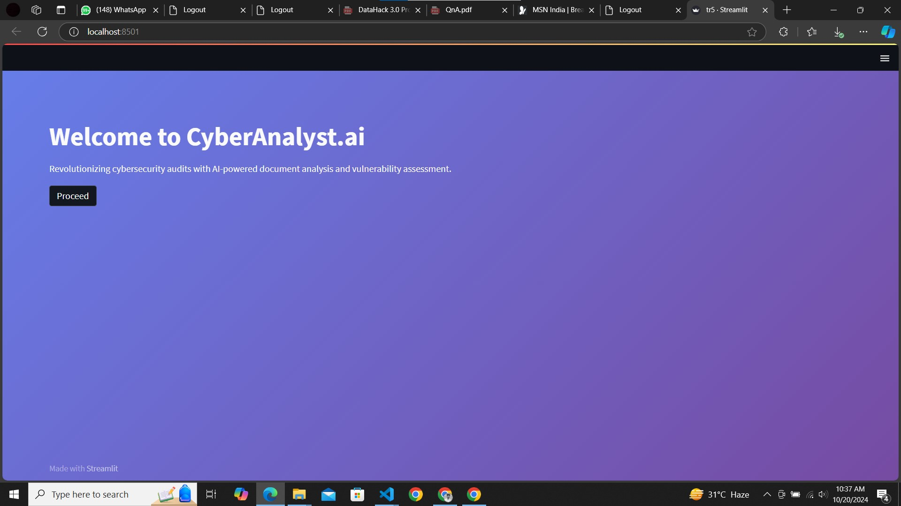

# CyberAnalyst.ai

Innovative AI-driven cybersecurity assessment platform designed to fortify organizations against the ever-present threat of cyber attacks in the gritty digital landscape. Our intelligent bot serves as a relentless cyber guardian, conducting comprehensive security evaluations through dynamic questioning and insightful analysis.

Key features:
1. Advanced Infrastructure Analysis: Our bot begins by analyzing uploaded infrastructure documentation, using NLP and text analysis to identify potential vulnerabilities and gaps in security.
2. Dynamic Questioning: Employing over 300 adaptive questions across crucial domains like Network Security, Data Protection, Incident Response, and Compliance, our bot digs deep into your organization's defenses.
3. Real-Time Risk Scoring: As the assessment progresses, bot calculates an instant risk score, providing a clear snapshot of your organization's security posture.
4. Actionable Insights: Upon completion, the bot generates a detailed report with prioritized, tailored recommendations to strengthen your cybersecurity defenses.
5. Compliance Verification: Checks your practices against common standards like GDPR and HIPAA, ensuring you stay ahead of regulatory requirements.

By leveraging the power of AI and NLP, CyberAnalyst.ai empowers organizations to proactively identify and address cybersecurity weaknesses, turning potential digital chaos into a robust defense strategy
